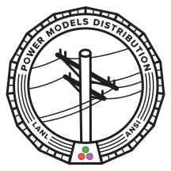

===

```@meta
CurrentModule = PowerModelsDistribution
```

## What is PowerModelsDistribution?

[PowerModelsDistribution.jl](https://github.com/lanl-ansi/PowerModelsDistribution.jl) is a Julia/JuMP-based package for modeling unbalanced (i.e., multiconductor) power networks.

## Resources for Getting Started

Read the [Installation Guide](@ref Installation-Guide)

Read the [Quickstart Guide](@ref Quick-Start-Guide)

Read the introductory tutorial [Introduction to PowerModelsDistribution](@ref Introduction-to-PowerModelsDistribution)

## How the documentation is structured

The following is a high-level overview of how our documetation is structured. There are three primary sections:

- The __Manual__ contains detailed documentation for certain aspects of PowerModelsDistribution, such as the [data model specification](@ref Engineering-Data-Model), the [Unbalanced Network Formulations](@ref Unbalanced-Network-Formulations), or the [Optimization Problem Specifications](@ref Problem-Specifications)

- __Tutorials__ contains working examples of how to use PowerModelsDistribution. Start here if you are new to PowerModelsDistribution.

- The __API Reference__ contains a complete list of the functions you can use in PowerModelsDistribution. Look here if you want to know how to use a particular function.

## Citing PowerModelsDistribution

If you find PowerModelsDistribution useful for your work, we kindly request that you cite the following [publication](https://doi.org/10.1016/j.epsr.2020.106664):

```bibtex
@article{FOBES2020106664,
title = "PowerModelsDistribution.jl: An open-source framework for exploring distribution power flow formulations",
journal = "Electric Power Systems Research",
volume = "189",
pages = "106664",
year = "2020",
issn = "0378-7796",
doi = "https://doi.org/10.1016/j.epsr.2020.106664",
url = "http://www.sciencedirect.com/science/article/pii/S0378779620304673",
author = "David M. Fobes and Sander Claeys and Frederik Geth and Carleton Coffrin",
keywords = "Nonlinear optimization, Convex optimization, AC optimal power flow, Julia language, Open-source",
abstract = "In this work we introduce PowerModelsDistribution, a free, open-source toolkit for distribution power network optimization, whose primary focus is establishing a baseline implementation of steady-state multi-conductor unbalanced distribution network optimization problems, which includes implementations of Power Flow and Optimal Power Flow problem types. Currently implemented power flow formulations for these problem types include AC (polar and rectangular), a second-order conic relaxation of the Branch Flow Model (BFM) and Bus Injection Model (BIM), a semi-definite relaxation of BFM, and several linear approximations, such as the simplified unbalanced BFM. The results of AC power flow have been validated against OpenDSS, an open-source “electric power distribution system simulator”, using IEEE distribution test feeders (13, 34, 123 bus and LVTestCase), all parsed using a built-in OpenDSS parser. This includes support for standard distribution system components as well as novel resource models such as generic energy storage (multi-period) and photovoltaic systems, with the intention to add support for additional components in the future."
}
```

The associated Power Systems Computation Conference talk can be found on [YouTube](https://youtu.be/S7ouz2OP0tE)

## License

This code is provided under a BSD license as part of the Multi-Infrastructure Control and Optimization Toolkit (MICOT) project, LA-CC-13-108.
