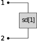
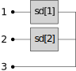
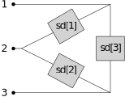
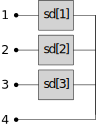
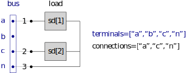
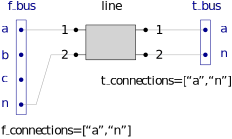

# Connecting Components

One of the main goals of a network model, is specifying how constituent components are connected together. The patterns explained here, are equally applicable to the engineering and mathematical data model.

The available connections of each component connect to bus terminals. Take for example a bus with four terminals, `terminals=["a","b","c","n"]`.

## Node objects

Node objects always connect to a single bus (and perhaps also the universal ground, as can be the case for shunts). Therefore, they always have at least two key fields controlling the connectivity: `bus` and `connections`. Most node objects also have a `configuration` field, which affects the interpretation of the values supplied in `connections`. We will illustrate this for loads below.

### Loads

A multi-phase load consists of several individual loads, the number of which is implied by the length of properties such as `pd_nom`, `qd_nom` etc. The table below illustrates how the *length* of the field `connections` and the *value* of the field `configuration` determines the layout of the load.

| `connections` | `configuration==WYE`                            | `configuration==DELTA`                              |
| ------------- | ----------------------------------------------- | --------------------------------------------------- |
| 2             |  |    |
| 3             |  |  |
| 4             |  | undefined                                           |

For example, we wish to connect a wye-connected load consisting of 2 individual loads (`|connections|=3` and `configuration=WYE`) to our example bus with four available terminals. If we specify `connections=["a","c","n"]`, this leads to

.

## Edge objects

Edge objects connect two buses (except for generic `transformers`, which can connect `N` buses). Therefore, they have the fields

- `f_bus` and `f_connections`, specifying the from-side bus and how the object connects to it;
- `t_bus` and `t_connections`, specifying the same for the to-side.

### Lines

A line can have a variable number of conductors, which is implied by the size of the fields `rs`, `xs`, `g_fr`, `b_fr`, `g_to` and `b_to`. The fields `f_connections` and `t_connections` should specify for each conductor, to which terminals it connects. The figure below illustrates this for a line with 2 conductors,

.

### Transformers

Transformers also have a `configuration` field. For

- generic transformers, this is specified per winding, and `configuration` is therefore a vector of `ConnConfig` enums (`WYE` or `DELTA`);
- AL2W transformers however are always two-winding, and the secondary is always wye-connected. Therefore, `configuration` is a scalar, specifying the configuration of the from-side winding.

Generic transformers have a field `buses`, a Vector containing the buses to which each winding connects respectively (these do not have to be unique; a split-phase transformer is typically represented by having two windings connect to the same bus). The AL2W transformer however, since it is always two-winding, follows the `f_connections`/`t_connections` pattern.
